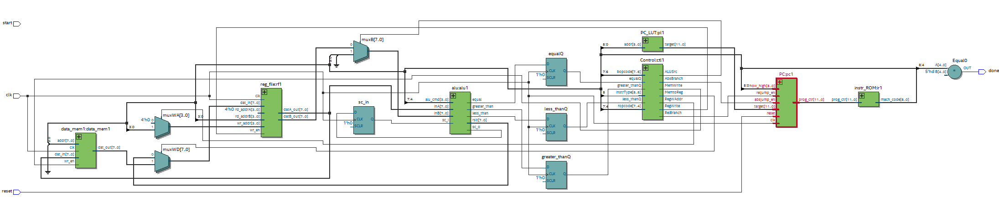

# Paccumulator - CSE 141L microprocessor project

## Assembler Usage:
1. Go to the designated directory for the program you want to assemble.
2. Type `python assembler.py` into the terminal and it will generate the files `lut.txt` and `mach_code.txt` based on the contents of `programX.txt`.

## To test: 
1. Ensure all SystemVerilog files are compiled and synthesizable as well as other necessary files such as `lut.txt` and `mach_code.txt` are in the same directory.
2. Open a new project in ModelSim and add the necessary files for the program you want to test, including all relevant testbench files (TopLevel0, data_mem0, testbench itself).
3. Compile and start simulation, and include waves for each signal you want to observe.

## Changes from Original testbench:
1. Program 1: "Top_level0.sv" line 51 changed from `#20000ns` to `#200ns`

## Program 1: 16 bit sign and magnitude (8 integer + 8 fractional) to 16 bit IEEE floating point format
### Score: 20/20

## Program 2: 16 bit IEEE floating point to 16 bit sign and magnitude (8 integer + 8 fractional)
### Score: 31/31

## Program 3: 16 bit floating point addition
### Score: 12/12

1. #  Introduction

Our architecture is named Paccumulator. Our overall philosophy is similar to an accumulator architecture and draws inspiration from ARM instructions / naming conventions. Our goals are to utilize an implied register to save precious bit-space in the instruction width to support 16 registers and 16 ALU functions. We classify our machine as a pseudo-accumulator. Most instructions utilize an implied destination register, while a few (so far, just bitwise NOT) work in-place on the specified source register. We handle double precision by working with one half (upper or lower byte) of the input data at a time. This is facilitated by our large number of general purpose registers (15). In the software specification, we will be sure to store our shift outs and OR them together to achieve coordinated shifting across both bytes.

2. #  Architectural Overview

![][image1]

3. #  Machine Specification

## Instruction formats

| TYPE | FORMAT | CORRESPONDING INSTRUCTIONS |
| :---- | :---- | :---- |
| R | 1 bit type, 4 bits funct, 4 bits operand register | and, add, sub, etc. |
| B | 1 bit type, 2 bits opcode, 6 bits lut address | breq, brne, brlt, brgt |

## Operations

| NAME | TYPE | BIT BREAKDOWN | EXAMPLE | NOTES |
| :---- | :---- | :---- | :---- | :---- |
| breq \= branch if equal | B | 1 bit type (1) 2 bits opcode (00) 6 bits signed relative jump distance (XXXXXX) | \# Assume equalQ is 1 \# Assume LUT address 01000 has 0b0000\_0000\_1010  `breq` 01000 `⇔ 1_00_`01000  \# after breq instruction, program counter moves to instruction address 0b0000\_0000\_1010 | flags equal, greater\_than, and less\_than are stored to special registers equalQ, greater\_thanQ, and less\_thanQ for one clock cycle |
| brlt \= branch if less than | B | 1 bit type (1) 2 bits opcode (01) 6 bits signed relative jump distance (XXXXXX) | \# Assume less-thanQ is 1 \# Assume LUT address 01000 has 0b0000\_0000\_1010  `brlt` 01000 `⇔ 1_10_`01000  \# after brlt instruction, program counter moves to instruction address 0b0000\_0000\_1010 | flags equal, greater\_than, and less\_than are stored to special registers equalQ, greater\_thanQ, and less\_thanQ for one clock cycle |
| brgt \= branch if greater than | B | 1 bit type (1) 2 bits opcode (10) 6 bits signed relative jump distance (XXXXXX) | \# Assume greater\_thanQ is 1 \# Assume LUT address 01000 has 0b0000\_0000\_1010  `brgt` 01000 `⇔ 1_11_`01000  \# after brgt instruction, program counter moves to instruction address 0b0000\_0000\_1010 | flags equal, greater\_than, and less\_than are stored to special registers equalQ, greater\_thanQ, and less\_thanQ for one clock cycle |
| bneq \= branch if not equal | B | 1 bit type (1) 2 bits opcode (11) 6 bits signed relative jump distance (XXXXXX) | \# Assume less\_thanQ | greater\_thanQ is 1 \# Assume LUT address 01000 has 0b0000\_0000\_1010  `brne` 01000 `⇔ 1_01_`01000  \# after brne instruction, program counter moves to instruction address 0b0000\_0000\_1010 | flags equal, greater\_than, and less\_than are stored to special registers equalQ, greater\_thanQ, and less\_thanQ for one clock cycle |
| load \= load from memory | R | 1 bit type (0) 4 bits funct (0000) 4 bits mem address (XXXX) | \# Assume memory address 0001 has 0b1001\_0000  `load 0001 ⇔ 0_0000_0001`  \# after load instruction, imp\_reg now holds 0b1001\_0000 | implied destination register: imp\_reg |
| stor \= store to memory | R | 1 bit type (0) 4 bits funct (0001) 4 bits mem address (XXXX) | \# Assume imp\_reg has 0b0001\_0001  stor `0001 ⇔ 0_0001_0001`  \# after stor instruction, memory address 0001 now holds 0b0001\_0001 | implied source register: imp\_reg |
| movf \= move from register | R | 1 bit type (0) 4 bits funct (0010) 4 bits source reg (XXXX) | \# Assume R1 has 0b1001\_0000  movf `R1 ⇔ 0_0010_0001`  \# after movf instruction, imp\_reg now holds 0b1001\_0000 | implied destination register: imp\_reg |
| movt \= move to register | R | 1 bit type (0) 4 bits funct (0011) 4 bits destination reg (XXXX) | \# Assume imp\_reg has 0b0001\_0001  movt `R1 ⇔ 0_0011_0001`  \# after movt instruction, R1 now holds 0b0001\_0001 | implied source register: imp\_reg |
| movi \= move immediate to register | R | 1 bit type (0) 4 bits funct (0100) 4 bits immediate val (XXXX) | `movi 0111 ⇔ 0_0100_0111`  \# after movi instruction, imp\_reg now holds 0b0000\_0111 | implied destination register: imp\_reg |
| cmpr \= compare | R | 1 bit type (0) 4 bits funct (0101) 4 bits operand\_2 reg (XXXX) | \# Assume imp\_reg has 0b0000\_0010 \# Assume R1 has 0b0000\_0010  `cmpr R1 ⇔ 0_0101_0001`  \# after cmpr instruction, cmpr\_reg now holds 0b0000\_0000 (equal to) | implied destination register: cmpr\_ reg (special register for branch use) implied operand\_1: imp\_reg |
| bnot \=  bitwise not | R | 1 bit type (0) 4 bits funct (0110) 4 bits operand reg (XXXX) | \# Assume R1 has 0b1001\_0000  bnot `R1 ⇔ 0_0110_0001`  \# after bnot instruction, imp\_reg now holds 0b0110\_111 | flips the bits in the operand register |
| borr \= bitwise or | R | 1 bit type (0) 4 bits funct (0111) 4 bits operand\_2 reg (XXXX) | \# Assume imp\_reg has 0b0001\_0001 \# Assume R1 has 0b1001\_0000  `borr R1 ⇔ 0_0111_0001`  \# after borr instruction, imp\_reg now holds 0b1001\_0001 | implied destination register: imp\_reg implied operand\_1: imp\_reg |
| band \= bitwise and | R | 1 bit type (0) 4 bits funct (1000) 4 bits operand\_2 reg (XXXX) | \# Assume imp\_reg has 0b0001\_0001 \# Assume R1 has 0b1001\_0000  `band R1 ⇔ 0_1000_0001`  \# after band instruction, imp\_reg now holds 0b0001\_0000 | implied destination register: imp\_reg implied operand\_1: imp\_reg |
| lshl \= logical shift left | R | 1 bit type (0) 4 bits funct (1001) 4 bits operand\_2 reg (XXXX) | \# Assume imp\_reg has 0b0001\_0001 \# Assume R1 has 0b0000\_0010  lshl `R1 ⇔ 0_1001_0001`  \# after lshl instruction, imp\_reg now holds 0b0100\_0100 | logic left shifts bits in imp\_reg reg by value in operand\_2 reg (0 filled, no sign preservation) implied destination register: imp\_reg implied operand\_1: imp\_reg |
| lshr \= logical shift right | R | 1 bit type (0) 4 bits funct (1010) 4 bits operand\_2 reg (XXXX) | \# Assume imp\_reg has 0b0001\_0001 \# Assume R1 has 0b0000\_0010  lshr `R1 ⇔ 0_1010_0001`  \# after lshr instruction, imp\_reg now holds 0b0000\_0100 | logic right shifts bits in imp\_reg reg by value in operand\_2 reg (0 filled, no sign preservation) implied destination register: imp\_reg implied operand\_1: imp\_reg |
| addr \= add register value | R | 1 bit type (0) 4 bits funct (1011) 4 bits operand\_2 reg (XXXX) | \# Assume imp\_reg has 0b0001\_0011 \# Assume R1 has 0b0000\_0010  addr `R1 ⇔ 0_1011_0001`  \# after addr instruction, imp\_reg now holds 0b0000\_0101 | implied destination register: imp\_reg implied operand\_1: imp\_reg |
| subr \= subtract register value | R | 1 bit type (0) 4 bits funct (1100) 4 bits operand\_2 reg (XXXX) | \# Assume imp\_reg has 0b0001\_0011 \# Assume R1 has 0b0000\_0010  subr `R1 ⇔ 0_1100_0001`  \# after subr instruction, imp\_reg now holds 0b0000\_0001 | implied destination register: imp\_reg implied operand\_1: imp\_reg |
| halt | R | 1 bit type (0) 4 bits funct (1101) 4 bits dont care (XXXX) |  | halts execution |
| addc \= add register value with shift carry in enabled | R | 1 bit type (0) 4 bits funct (1110) 4 bits operand\_2 reg (XXXX) | \# Assume imp\_reg has 0b0001\_0011 \# Assume R1 has 0b0000\_0010 \# Assume sc\_in has 1  addr `R1 ⇔ 0_1011_0001`  \# after addr instruction, imp\_reg now holds 0b0000\_0111 \# after addr instruction, sc\_in now holds 0 | implied destination register: imp\_reg implied operand\_1: imp\_reg |
| subc \= subtract register value with shift carry in enabled | R | 1 bit type (0) 4 bits funct (1111) 4 bits operand\_2 reg (XXXX) | \# Assume imp\_reg has 0b0001\_0011 \# Assume R1 has 0b0000\_0010 \# Assume sc\_in has 1  subr `R1 ⇔ 0_1100_0001`  \# after subr instruction, imp\_reg now holds 0b0000\_0010 \# after addr instruction, sc\_in now holds 0 | implied destination register: imp\_reg implied operand\_1: imp\_reg |

## \*we believe the project is completable with just these instructions, but we may fill in the greyed boxes if we find we want more ALU operations

## Internal Operands

16 regfile registers are supported. Additionally, there is a special cmpr\_reg which serves as the destination for cmpr instructions and the source for branch instructions. This cmpr\_register is not accessible to load, store, or move commands and thus outside of the regfile. One of our regfile registers is an accumulator. While none of our registers are enforced in the hardware as constant, we fo recommend that programmers use some of them to store constants.

## Control Flow (branches)

Relative branch if equal, branch if not equal, branch if less than, and branch if greater than are supported. Target addresses are computed by adding the signed relative jump value from the machine code to the program counter. 6 bits of machine code are dedicated to jump value, so a maximum branch distance of 32 backward and 31 forward is supported. If our software implementation forces us to accommodate larger jumps than that, we will switch to a lookup table.

## Addressing Modes

For branching, relative direct addressing is supported via a lookup table. For load/store, absolute direct addressing is supported. Addresses for branching are calculated by adding the signed relative jump value from the machine code's lower 6 bits to the program counter. Addresses for load/store are "calculated" by taking the lower 4 bits of the machine code. While this only supports access to the lowest 16 data memory addresses, that is all we need. Data memory addresses 0-13 are used for input/output to the testbench. Addresses 14-15 are free for use by the programmer.  
examples:

| branching | load / store |
| :---- | :---- |
| \# Assume cmpr\_reg has 0b0000\_0000 \# Assume LUT address 01000 has 0b0000\_0000\_1010  `breq` 01000 `⇔ 1_00_`01000  \# after breq instruction, program counter moves to instruction address 0b0000\_0000\_1010 | \# Assume memory address 0001 has 0b1001\_0000  `load 0001 ⇔ 0_0000_0001`  \# after load instruction, imp\_reg now holds 0b1001\_0000 |

4. #  Programmer's Model \[Lite\]

4.1  
A programmer should think about our machine as an accumulator. The only instruction that does not use the implied register is bitwise NOT. Paccumulator supports a large number of general purpose registers (15), so it is recommended that the programmer dedicate a number of registers to a specific function or to store a constant value. For example, in Program 1, the programmer may dedicate a register to each of the following: upper byte, lower byte, exponent. Our load/store functions have access to memory addresses 0 through 15\. Memory addresses 0 through 13 are used for input output, leaving only two memory locations for general purpose use. Because of this, we strongly recommend that the programmer use load/store sparingly and rely on the general purpose registers for storing values during calculations.

4.2  
The instructions cannot be copied from MIPS or ARM ISA because our instruction set is confined to a 9-bit width while MIPS and ARM use a 32-bit instruction width. To overcome this, our design is for a pseudo-accumulator which uses an implied destination and operand\_1 register. This makes it so we only have to specify the operand\_2 register in our instructions. We are most familiar with ARM so, while our instructions are quite different, the language conventions we use may feel familiar to ARM programmers.

4.3  
Yes, our ALU will be used for the non-arithmetic compare and move functions. This will complicate our design by requiring muxes to select ALU input source and output destination.

5. #  Individual Component Specification

   1. Top Level  
      1. Module file name: top\_level.sv  
      2. Functionality Description: Main component that instantiates all other components and adds connections between modules  
      3. Schematic:   
         ![][image2]  
   2. Program Counter   
      1. Module file name: PC.sv  
      2. Module testbench file name: PC\_tb.sv  
      3. Functionality Description: 12 bit program counter that increments the processor to perform certain instructions for the program based on given signals.  
      4. (Optional) Testbench Description: The testbench tests if the program counter is able to increment successfully as well as if it jumps correctly given the signals: reljump\_en and reset.  
      5. Schematic:  
          ![][image3]  
      6. (Optional) Timing Diagram: I was unable to attain a timing diagram for this testbench.  
   3. Instruction Memory   
      1. Module file name: inst\_ROM.sv  
      2. Functionality Description: Loads generated machine code from an assembler onto a lookup table holding up to 4096 instructions.  
      3. Schematic:   
         ![][image4]  
   4. Control Decoder  
      1. Module file name: Control.sv  
      2. Functionality Description: Generates control signals based on the current instruction, determining the instrType, bopcode, and ropcode. It also has 1 bit input flags used for branching that is determined from compares, and outputs signals that tell the processor whether to branch, write to memory, choose ALU sources or write to registers, etc.  
      3. Schematic:   
         ![][image5]  
   5. Register File   
      1. Module file name: reg\_file.sv  
      2. Functionality Description: Contains 16 registers and 2 combinational read ports with a synchronous write port determined by wr\_en to write values to a desired register  
      3. Schematic:   
         ![][image6]  
   6. ALU   
      1. Module file name: alu.sv  
      2. Module testbench file name: alu\_tb.sv  
      3. Functionality Description: Takes two 8-bit inputs (inA, inB) and a 4-bit command (alu\_cmd) to perform various arithmetic and logic operations. The module outputs the result (rslt), a shift carry (sc\_o), and status flags (zero, equal, less\_than, greater\_than) that determine the outcome of the operation and possible branching.  
      4. (Optional) Testbench Description: TODO. Describe your testbench. How does it work? What test cases does it test?  
      5. ALU Operations: What ALU operations will you be demonstrating? What instructions are they relevant to?  
         1. Data Movement  
            1. MOVF, MOVI, MOVT are operations that transfer data from register to register or from immediate to register  
         2. Comparison  
            1. Sets the equal, less\_than, and greater\_than flags based on the values stored in inA and inB  
         3. Bitwise Operations  
            1. BNOT, BORR, BAND are bitwise logic operations NOT, OR, and AND.  
         4. Arithmetic Operations  
            1. LSHL, LSHR are logical left and right shifts respectfully  
            2. ADDR, SUBR are adding and subtracting register values respectfully

      6. Schematic:  
         ![][image7]  
      7. (Optional) Timing Diagram: TODO. Show us a screenshot of the timing diagram that demonstrates all relevant operations you mentioned in the ALU Operations section.  
   7. Data Memory  
      1. Module file name: dat\_mem.sv  
      2. Functionality Description: 8 bit wide 256 bit deep memory that uses combinational reads so that dat\_out is always the value stored at addr without requiring a signal. It uses a write enable to update the value at addr.  
      3. Schematic:   
         ![][image8]  
   8. Branch LUT  
      1. Module file name: PC\_LUT.sv  
      2. Functionality Description: looks up 6 bit targets and returns 12 bit PC target  
      3. Schematic:   
         ![][image9]

6. #  Program Implementation / Software \- provide as attachments

### Program 1 Assembly Code \- program1.txt

### Program 1 Machine Code \- mach\_code1.txt

### Program 2 Assembly Code \- kate\_program2.txt

### Program 2 Machine Code \- mach\_code2.txt

### Program 3 Assembly Code \- program3.txt

### Program 3 Machine Code \- mach\_code3.txt

### Assembler \- assembler.py

To run, just have all assembly code files in the same directory as the python and use the terminal command “python assembler.py” to generate the machine codes and look up tables for each program.

7. #  Changelog

* Milestone 3  
  * Machine Specification  
    * Operations  
      * added halt instruction  
      * added addc and subc (adding and subtracting with shift carry in enabled)  
  * Individual Component Specification  
    * added PC\_LUT.sv  
    * changed to absolute branching  
    * added instr\_ROM.sv  
    * Added start port to top level  
  * Program Implementation / Software  
    * added software according to Milestone 3 addon template  
* Milestone 2  
  * Introduction  
    * expanded on how we plan to handle double precision  
  * Architectural Overview  
    * updated design to match the top level design of the components  
  * Machine Specification  
    * Operations  
      * reordered branch (B type) instructions  
    * Internal Operands  
      * removed constant registers  
    * Control Flow  
      * added reserved 9th B type bit to expand jump address from 5 to 6 bits  
    * Addressing Modes  
      * changed absolute indirect branching to relative direct branching  
  * Programmer's Model  
    * updated to account for design changes  
  * Individual Component Specification  
    * added component specifications according to Milestone 2 addon template  
* Milestone 1  
  * Initial Version

